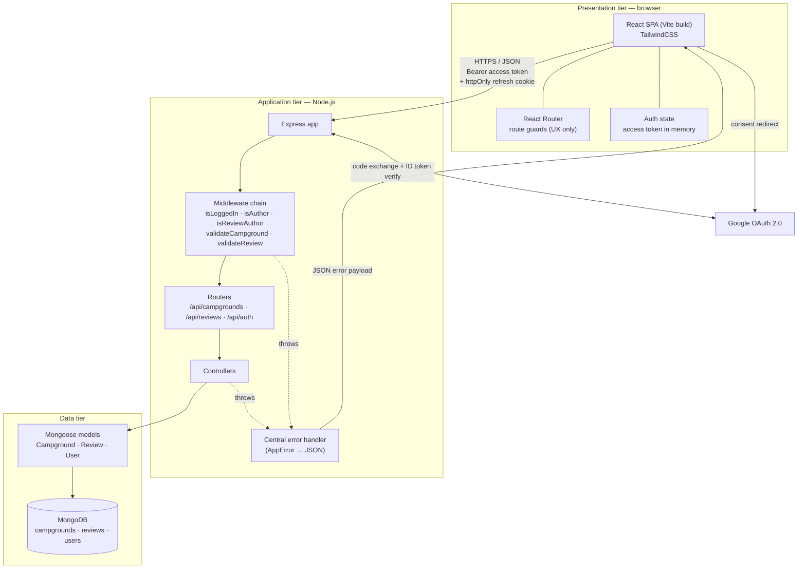
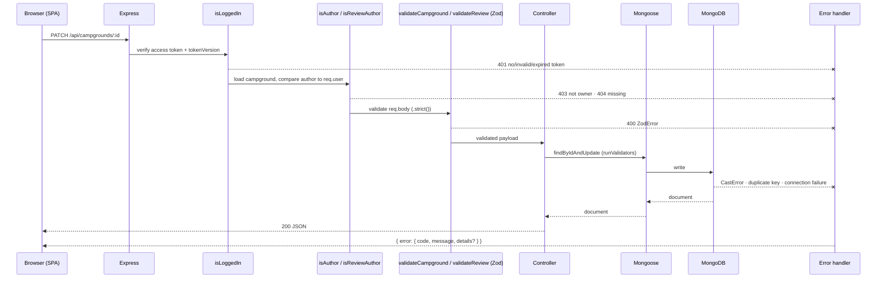
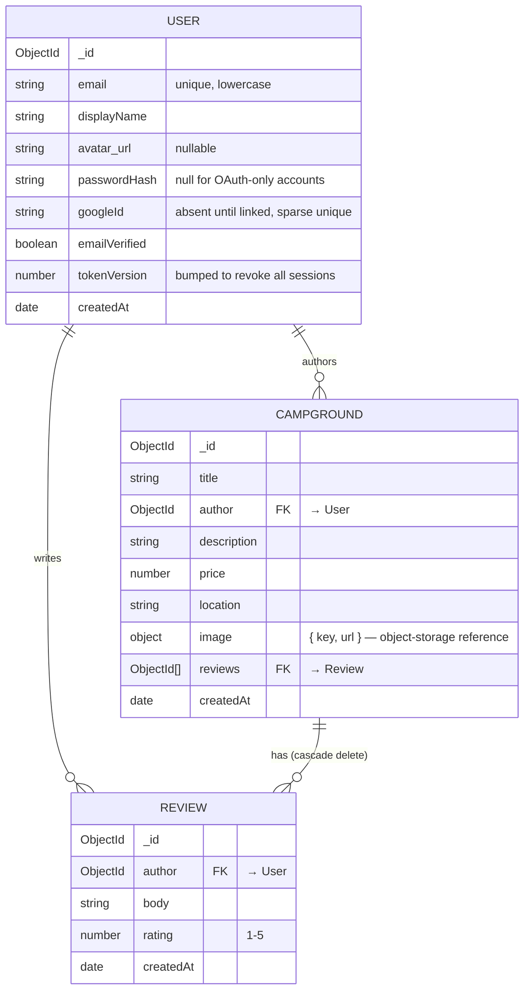
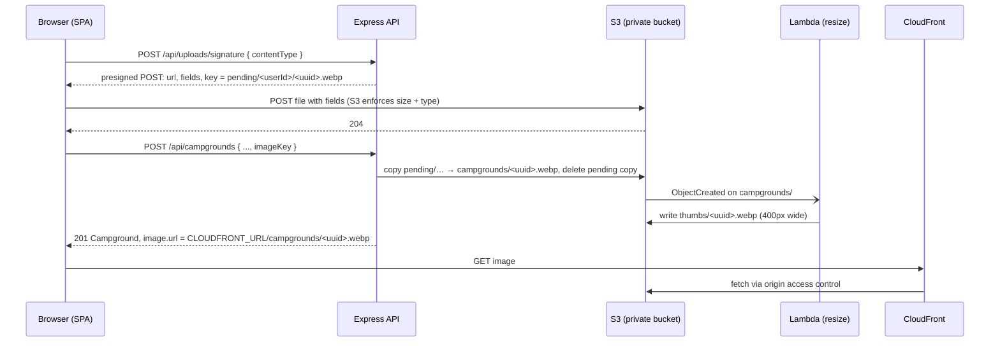

# Overview
Capstone Project known as YelpCamp, where users can review camps. Users can own profiles, review other camps and add data about camps not found elsewhere.

**Documentation map**

| Doc | Covers |
|---|---|
| ARCHITECTURE.md | System design: tiers, data model, validation, directory layout, middleware, client routes, shared contract, config, images, testing, deployment |
| [API.md](./API.md) | Every endpoint and the pagination contract |
| [AUTH.md](./AUTH.md) | Tokens, revocation, and the login, refresh, Google, verification, and reset flows |
| [ERROR_HANDLING.md](./ERROR_HANDLING.md) | Every error class, response, and error code |
| [ADR.md](./ADR.md) | Decisions and the alternatives rejected, plus what's still open |

# Tech Stack
**Languages**: TypeScript, CSS

**Runtime**: Node.js

**Database**: MongoDB

**Frameworks**: React (frontend), Express 5 (backend), TailwindCSS (layout), MUI (components)

**Key Libraries**:

| Library | Layer | Purpose |
|---|---|---|
| `mongoose` | data | ODM — schemas, document validation, `populate`, cascade hooks |
| `zod` | shared | Request-body validation at the API boundary, and the single source of the request types (see [Validation layers](#validation-layers)) |
| `jsonwebtoken` | backend | Sign and verify access/refresh tokens |
| `bcrypt` | backend | Password hashing |
| `google-auth-library` | backend | Verify Google ID tokens, exchange authorization codes |
| `cors` | backend | Cross-origin allow-list for the SPA |
| `dotenv` | backend | Environment config |
| `express-rate-limit` | backend | Throttle `/auth/login` and `/auth/register` |
| `react-router` | frontend | Client-side routing |
| `@mui/material` + `@emotion/*` | frontend | Component library — dialogs, menus, toasts, form fields ([ADR-011](./ADR.md#adr-011-mui-components-on-tailwind-layout)) |
| `vite` | build | Dev server and production bundle |
| `@aws-sdk/client-s3` | backend | Copy and delete stored images |
| `@aws-sdk/s3-presigned-post` | backend | Signs direct browser uploads, with size and type limits built in |
| `typescript` | build | The compile-time contract between the two deployables (see [The shared contract](#the-shared-contract)) |
| `tsx` | build | Runs the server's TypeScript directly in development — no build step |
| `helmet` | backend | Security response headers |
| `pino` | backend | Structured logging, including the correlation ID ERROR_HANDLING §9 depends on |

Why each of these was chosen, and what was rejected, is recorded in **[ADR.md](./ADR.md)**.

# High-level Architecture
We're working with a three-tier client-server architecture. The React SPA is served as static assets and talks to the Express API over JSON only — there is no server-rendered HTML, so the API never returns views, just data and status codes.



## Request lifecycle
Every mutating request passes the same ordered gates. Order matters: authentication precedes authorization, which precedes schema validation, so an unauthenticated caller never learns whether a resource exists.



# Data model



Deleting a campground must cascade to its reviews (a Mongoose `findOneAndDelete` post-hook); otherwise the `reviews` collection accumulates orphans that no endpoint can reach.

The campground → review relationship is stored once, as the `Campground.reviews` array of ids. Reviews hold no reference back to their campground: every review route is nested under `/api/campgrounds/:id`, so the campground is always known from the URL. Deleting a campground deletes exactly the reviews its array lists (`Review.deleteMany({ _id: { $in: campground.reviews } })`).

## Mongoose models

Each model is an interface passed to the schema generic. The interfaces are the **database** shape (`ObjectId`, `Date`); what crosses the wire is a separate DTO in `shared/` with `string` ids and ISO date strings — see [The shared contract](#the-shared-contract).

```ts
export interface CampgroundInterface {
    title: string; 
    author: Types.ObjectId; 
    description: string;
    price: number; 
    location: string;
    image: { key: string; url: string };            // see Image storage
    reviews: Types.ObjectId[];
    averageRating: number; 
    reviewCount: number;   // denormalized — see below
    createdAt: Date; 
    updatedAt: Date;
}
export interface ReviewInterface {
    author: Types.ObjectId;
    body: string; 
    rating: number; 
    createdAt: Date; 
    updatedAt: Date;
}
export interface UserInterface {
    email: string; 
    name: string; 
    avatar_url: string | null;
    passwordHash: string | null; 
    googleId?: string;   // absent, never null
    emailVerified: boolean; 
    tokenVersion: number;
    createdAt: Date; 
    updatedAt: Date;
}
```

```ts
const CampgroundSchema = new Schema<CampgroundInterface>({
    title:       { type: String, required: true, trim: true, maxlength: 100 },
    author:      { type: Schema.Types.ObjectId, ref: 'User', required: true },
    description: { type: String, required: true, trim: true, maxlength: 5000 },
    price:       { type: Number, required: true, min: 0 },
    location:    { type: String, required: true, trim: true },
    image: {
        key: { type: String, required: true },   // S3 object key, e.g. campgrounds/<uuid>.webp
        url: { type: String, required: true },   // built by the server from key, never taken from the client
    },
    reviews:     [{ type: Schema.Types.ObjectId, ref: 'Review' }],
    averageRating: { type: Number, default: 0, min: 0, max: 5 },
    reviewCount:   { type: Number, default: 0, min: 0 },
}, { timestamps: true });

const ReviewSchema = new Schema<ReviewInterface>({
    author:     { type: Schema.Types.ObjectId, ref: 'User', required: true },
    body:       { type: String, required: true, trim: true, maxlength: 1000 },
    rating:     { type: Number, required: true, min: 1, max: 5 },
}, { timestamps: true });

const UserSchema = new Schema<UserInterface>({
    email:         { type: String, required: true, unique: true, lowercase: true, trim: true },
    displayName:   { type: String, required: true, trim: true, maxlength: 50 },
    avatar_url:    { type: String, default: null },
    passwordHash:  { type: String, default: null, select: false },
    googleId:      { type: String, unique: true, sparse: true, select: false },  // no default
    emailVerified: { type: Boolean, default: false },
    tokenVersion:  { type: Number, default: 0 },
}, { timestamps: true });
```

Notes on the `User` model's auth fields (`select: false`, `googleId`, `passwordHash: null`, `emailVerified`, `tokenVersion`) are in [AUTH.md](./AUTH.md#the-user-models-auth-fields).

Notes on `Campground` and `Review`:

- **`ref` values are model names** (`'User'`, `'Review'`), not collection names. Mongoose resolves `ref` against registered models; `ref: 'reviews'` silently fails to populate.
- **`averageRating` / `reviewCount` are denormalized.** The index page shows a rating on every card; without these, a page of 12 cards is 12 review lookups. They are recomputed by the same code path that adds, edits, or deletes a review — the same path that already keeps `Campground.reviews` in sync.
- **Review writes touch two collections, so they run in a transaction.** Creating a review inserts the `Review` *and* updates its campground (push the id onto `reviews`, recompute `averageRating` and `reviewCount`). Deleting one reverses both (`$pull` the id, recompute). If only the first write lands, the two disagree: a review that exists but no campground lists (so the cascade delete can never reach it), or a campground listing an id that no longer exists, with a rating that counts the wrong reviews. A transaction makes the pair all-or-nothing. Transactions need a replica set: Atlas provides one, and local development uses Atlas or a single-node replica set, because a standalone `mongod` rejects them.
- **Populate is typed by assertion**, e.g. `.populate<{ author: IUser }>('author')`. The compiler trusts the generic; a wrong one compiles while being false. Keep populate calls in one place per model so there is one assertion to check.

Revocation is global, via `tokenVersion` — see [AUTH.md](./AUTH.md#revocation).

## Validation layers

Zod and Mongoose validate different objects and both are kept:

| | Zod | Mongoose |
|---|---|---|
| Validates | The HTTP **request** — body, params, and query | The **document** about to be written |
| Runs in | `validate(schema)` middleware | `save()` / `findByIdAndUpdate({ runValidators: true })` |
| Catches | Client sent garbage | Any code path writes garbage — including seeds and scripts |
| Error type | `ZodError` | `mongoose.Error.ValidationError` |

This is why uniqueness isn't a Zod concern — it is a property of a collection, and a request has no knowledge of one. It belongs to the Mongoose index, and surfaces as a duplicate-key error (see ERROR_HANDLING.md section 6).

The request schemas live in `shared/` so the SPA's forms and the API enforce the same rules by construction, and they are deliberately **not** mirrors of the models. They contain only client-writable fields:

```ts
// shared/src/schemas.ts
export const campgroundBody = z.object({
    title:       z.string().trim().min(1).max(100),
    description: z.string().trim().min(1).max(5000),
    price:       z.number().min(0).multipleOf(0.01),
    location:    z.string().trim().min(1),
    imageKey:    z.string().regex(/^pending\/[a-f0-9]{24}\/[a-f0-9-]{36}\.(jpg|png|webp)$/),  // pending/<userId>/<uuid>.<ext>
}).strict();

export const reviewBody = z.object({
    body:   z.string().trim().min(1).max(1000),
    rating: z.number().int().min(1).max(5),
}).strict();

// PATCH routes use .partial() — every field optional, still .strict() —
// plus a refine that rejects an empty body:
export const campgroundPatch = campgroundBody.partial()
    .refine(b => Object.keys(b).length > 0, 'Send at least one field');
export const reviewPatch = reviewBody.partial()
    .refine(b => Object.keys(b).length > 0, 'Send at least one field');

export type CampgroundBody = z.infer<typeof campgroundBody>;
export type ReviewBody     = z.infer<typeof reviewBody>;
```

`author`, `campground`, `reviews`, `_id`, and the timestamps are absent on purpose. The controller sets `author` from `req.user._id`, never from the body. `.strict()` **rejects** any unknown key with a 400 rather than silently dropping it — the mass-assignment defense, made loud so a client bug surfaces instead of being hidden.

**Params and query are validated too.** `:id` passes through an ObjectId schema before any query runs (so a malformed id is a clean 404, not a `CastError`), and `?page`/`?limit` are coerced and capped. This, not the body schema alone, is what closes NoSQL operator injection (ERROR_HANDLING section 3): `?email[$ne]=x` parses to an object, and a schema that expects a string rejects it.

# Directory Structure
```
yelpCamp/
├── package.json                 # npm workspaces: shared, server, client
├── tsconfig.base.json           # strict settings inherited by all three
│
├── shared/                      # the compile-time contract — built first
│   └── src/
│       ├── errors.ts            # ErrorCode union
│       ├── api.ts               # Single<T>, Paginated<T>, ApiError, DTOs
│       └── schemas.ts           # Zod request schemas + inferred types
│
├── client/                      # React SPA — built by Vite (react-ts)
│   ├── src/
│   │   ├── main.tsx
│   │   ├── App.tsx              # router + providers
│   │   ├── routes/              # one file per client route (see Client Routes)
│   │   ├── components/          # CampgroundCard, Form, Navbar, Footer, …
│   │   ├── context/             # AuthContext — discriminated AuthState union
│   │   ├── lib/
│   │   │   └── api.ts           # typed fetch wrapper: attaches token, refreshes on 401
│   │   └── styles/
│   └── vite.config.ts           # dev proxy /api → localhost:3000
│
├── server/                      # Express 5 API
│   ├── src/
│   │   ├── app.ts               # express app: middleware, routers, error handler
│   │   ├── server.ts            # db connect → listen; fail fast if db is down
│   │   ├── config/
│   │   │   └── env.ts           # Zod-parsed env, typed — see Configuration
│   │   ├── types/
│   │   │   └── http.ts          # AuthedRequest, AuthedHandler
│   │   ├── models/              # campground.ts, review.ts, user.ts
│   │   ├── routes/              # routing only — no business logic
│   │   ├── controllers/
│   │   ├── middleware/
│   │   │   ├── requestId.ts     # correlation ID for logs + error responses
│   │   │   ├── isLoggedIn.ts    # narrows Request → AuthedRequest
│   │   │   ├── isAuthor.ts
│   │   │   ├── isReviewAuthor.ts
│   │   │   ├── validate.ts      # runs a Zod schema against body/params/query
│   │   │   └── errorHandler.ts
│   │   ├── services/
│   │   │   ├── tokens.ts        # sign/verify access + refresh
│   │   │   ├── google.ts        # google-auth-library: code exchange, ID token verify
│   │   │   └── storage.ts       # S3: presigned POST, promote pending → campgrounds/, delete, build CloudFront URLs
│   │   └── utils/
│   │       └── AppError.ts      # no catchAsync — Express 5 forwards rejections
│   └── test/                    # see Testing
│
├── seeds/                       # one-off DB seeding
│   ├── index.ts
│   ├── cities.ts
│   └── seedHelpers.ts
│
└── docs/
    ├── ARCHITECTURE.md
    └── ERROR_HANDLING.md
```

## Middleware
Registered in this order in `app.ts`. Order is a correctness property, not a style choice.

**App-level, before any router**
| Middleware | Purpose |
|---|---|
| `requestId` | Assigns a correlation ID; attached to every log line and to 500 responses so a user report can be matched to a log |
| `helmet` | Security headers. The API serves no HTML, so most matter little — `nosniff` and HSTS are the ones that count |
| `cors` | Origin allow-list per environment; `credentials: true` for the refresh cookie |
| `express.json({ limit })` | Body parsing. Rejects malformed JSON and oversized payloads *before* validation runs |
| `cookieParser` | Reads the httpOnly refresh cookie |
| `rateLimit` (global) | Loose limit on all `/api` routes, so write endpoints are not unthrottled |
| `rateLimit` (strict) | Tight limit on `/api/auth/login`, `/api/auth/register`, and the password-reset request |

**Per-route, in this sequence**
| Middleware | Purpose | Failure |
|---|---|---|
| **validate(params)** | Rejects a malformed `:id` before any query runs | 404 |
| **isLoggedIn** | Verifies the access token's signature (with `algorithms` explicitly allowlisted), expiry, and `tokenVersion` claim against the user; attaches `req.user` | 401 |
| **isAuthor** | Loads the campground and compares `author` to `req.user._id` | 403 (404 if missing) |
| **isReviewAuthor** | Checks the `:reviewId` is in the `:id` campground's `reviews` array, then compares `Review.author` to `req.user._id`. Without the membership check, `/campgrounds/A/reviews/<a review of B>` would delete the review but `$pull` it from the wrong campground | 403 (404 if missing, or not in that campground) |
| **validateCampground** | Runs the `campgroundBody` Zod schema (`.strict()`) | 400 with `details[]` |
| **validateReview** | Runs the `reviewBody` Zod schema (`.strict()`) | 400 with `details[]` |

Authentication before authorization before validation: an anonymous caller gets 401 and never learns whether the resource exists. The params check runs first only because a malformed id can't name a resource, so rejecting it leaks nothing.

Under TypeScript this ordering is enforced by type rather than convention: `isLoggedIn` is the only thing that turns a `Request` into an `AuthedRequest`, and controllers behind it are typed `AuthedHandler`, so mounting one on a route without `isLoggedIn` fails to compile.

**After all routers**
| Middleware | Purpose |
|---|---|
| `app.use(notFound)` | JSON 404 catch-all — otherwise Express returns an HTML error page. Pathless, so it matches everything no router handled. Express 5 throws at startup on the bare `'*'` pattern Express 4 accepted, and `'/*splat'` doesn't match `/` |
| `errorHandler` | Normalizes everything into the single error contract |

## Client Routes
React Router paths. These render components and hold no business logic; **every guard here is UX only** — it hides buttons and redirects early, and the server re-checks all of it. A user who edits their own JS bundle gets a nicer-looking 403, nothing more.

| Path | Renders | Guard | Data loaded from |
|---|---|---|---|
| `/` | Landing — hero image, login/signup CTA, navbar, footer | public | — |
| `/campgrounds` | Campground index — cards, paginated | public | `GET /api/campgrounds?page=1` |
| `/campgrounds/new` | Campground form (create) | authed, else → `/login` | — |
| `/campgrounds/:id` | Campground detail + review list + review form | public | `GET /api/campgrounds/:id` |
| `/campgrounds/:id/edit` | Campground form (edit) | authed **and** owner, else → detail | `GET /api/campgrounds/:id` |
| `/campgrounds/:id/reviews/:reviewId/edit` | Review form (edit) | authed **and** owner | `GET /api/campgrounds/:id/reviews/:reviewId` |
| `/register` | Register form | anon only, else → `/campgrounds` | — |
| `/login` | Login form + "Sign in with Google" | anon only, else → `/campgrounds` | — |
| `/auth/google/callback` | Spinner — hands the code to the API, then redirects | public | `GET /api/auth/google/callback` |
| `*` | Not found | public | — |

Required components: **Navbar** (auth-aware), **Footer** (contact info), **CampgroundCard**, **Form**, **Pagination**, **ErrorBoundary**. Dialogs, menus, toasts, and form fields come from MUI; layout and the project's own components use Tailwind ([ADR-011](./ADR.md#adr-011-mui-components-on-tailwind-layout)). Deferred to later iterations: search/filter, grid-size options.

Deletes have no client route — they are buttons on the detail page issuing `DELETE`, then redirecting.

## API Endpoints
Every endpoint, with its middleware, request schema, and responses, is in **[API.md](./API.md)**.

# The shared contract
The SPA and the API are two programs that agree on JSON. `shared/` is the compile-time form of that agreement: both sides import it, so a change on one side that breaks the other fails to compile instead of failing in the browser.

```ts
// shared/src/errors.ts
export const ERROR_CODES = [
    'VALIDATION_FAILED', 'MALFORMED_JSON', 'PAYLOAD_TOO_LARGE',
    'UNAUTHENTICATED', 'TOKEN_EXPIRED', 'TOKEN_REVOKED', 'INVALID_CREDENTIALS',
    'NOT_OWNER', 'CAMPGROUND_NOT_FOUND', 'REVIEW_NOT_FOUND', 'USER_NOT_FOUND',
    'ROUTE_NOT_FOUND', 'EMAIL_TAKEN', 'ACCOUNT_LINK_REFUSED',
    'UNSUPPORTED_MEDIA_TYPE', 'IMAGE_NOT_UPLOADED', 'LINK_INVALID',
    'RATE_LIMITED', 'UPSTREAM_UNAVAILABLE', 'INTERNAL',
] as const;
export type ErrorCode = typeof ERROR_CODES[number];

// shared/src/api.ts
export type FieldIssue   = { field: string; issue: string };
export type ApiError     = { error: { code: ErrorCode; message: string; details?: FieldIssue[] } };
export type Single<T>    = { data: T };
export type Paginated<T> = { data: T[]; meta: { page: number; limit: number; total: number; totalPages: number } };
```

- **`AppError` takes an `ErrorCode`,** so a mistyped code does not compile, and a `switch` on `error.code` in the SPA is checked for exhaustiveness — add a code and every unhandled switch fails. This is what makes "codes are never renamed without a version bump" (ERROR_HANDLING) enforceable.
- **DTOs are not models.** `CampgroundDTO` has `_id: string` and `createdAt: string`; `ICampground` has `ObjectId` and `Date`. Keeping them apart stops the SPA from calling `.getTime()` on a value that is actually a string.
- **`req.user` is not a global augmentation.** A distinct `AuthedRequest` type, produced only by `isLoggedIn`, keeps `req.user` non-optional where it is guaranteed and absent where it is not (see [Middleware](#middleware)).
- `shared/` has a real build (`tsc --watch` in development) because the Zod schemas are runtime values. It is built before `server/` and `client/`.

# Configuration
Every variable is parsed through a Zod schema in `config/env.ts` at boot. A missing or malformed value exits the process before `listen()` — the same fail-fast rule as a missing database (ERROR_HANDLING section 6) — and the result is a typed object, so no code reads `process.env` directly.

| Variable | Deployable | Notes |
|---|---|---|
| `NODE_ENV` | server | `development` \| `test` \| `production` — gates the `debug` key on error responses |
| `PORT` | server | |
| `MONGODB_URI` | server | Must point at a replica set if transactions are used |
| `JWT_ACCESS_SECRET` | server | ≥ 32 random bytes. Separate from the refresh secret, so one leaking does not forge the other |
| `JWT_REFRESH_SECRET` | server | ≥ 32 random bytes |
| `ACCESS_TOKEN_TTL` / `REFRESH_TOKEN_TTL` | server | e.g. `15m` / `7d` |
| `GOOGLE_CLIENT_ID` / `GOOGLE_CLIENT_SECRET` | server | |
| `GOOGLE_REDIRECT_URI` | server | Must match the Google console exactly, per environment. In production it is the Vercel origin — the rewrite forwards it to Render |
| `CORS_ORIGINS` | server | Development only — production is same-origin. Comma-separated allow-list; never `*` with credentials |
| `CLIENT_URL` | server | Where the OAuth callback and email links redirect |
| `BREVO_API_KEY` / `EMAIL_FROM` | server | Brevo credentials and the verified sender address ([ADR-016](./ADR.md#adr-016-brevo-for-transactional-email)) |
| `AWS_REGION` / `S3_BUCKET` | server | |
| `AWS_ACCESS_KEY_ID` / `AWS_SECRET_ACCESS_KEY` | server | Only where the host can't assume an IAM role. A dedicated IAM user whose policy allows exactly: `PutObject` on `pending/*`, `GetObject`/`DeleteObject` on `pending/*` and `campgrounds/*`, `PutObject` on `campgrounds/*`. Never the root account's keys |
| `CLOUDFRONT_URL` | server | Base URL image links are built from |
| `VITE_API_URL` | client | Build-time, **public** — anything prefixed `VITE_` ships in the bundle. Empty in production, because the SPA calls `/api/...` on its own origin |

`.env` is gitignored; `.env.example` with every key and no values is committed. Rotating `JWT_ACCESS_SECRET` or `JWT_REFRESH_SECRET` logs everyone out — acceptable, and the fastest response to a suspected leak.

# Indexes
One inventory, so an index is not added by one section and forgotten by another.

| Collection | Index | Serves |
|---|---|---|
| users | `{ email: 1 }` unique | Login lookup, registration's 409 |
| users | `{ googleId: 1 }` unique, sparse | Google sign-in lookup. Sparse skips accounts where the field is absent — which is why it has no `null` default |
| campgrounds | `{ createdAt: -1, _id: -1 }` | Stable paginated index sort |
| campgrounds | `{ author: 1, createdAt: -1 }` | `GET /api/users/:id/campgrounds` |

`autoIndex` is on in development and off in production, where indexes are built by an explicit script — building an index on boot against a large collection stalls startup.

# Image storage
Images live in a **private** S3 bucket and are served through CloudFront. The browser uploads straight to S3; the API only signs the upload and records the result.



**Bucket layout** — one bucket, three prefixes:

| Prefix | Written by | Lifetime |
|---|---|---|
| `pending/<userId>/` | The browser, via presigned POST | Deleted by a lifecycle rule after 1 day |
| `campgrounds/` | The API, when a campground is saved | Until the campground is deleted |
| `thumbs/` | The resize Lambda | Deleted alongside its original |
| `seed/` | Uploaded once by hand | Permanent — never touched by cleanup |

- **The client sends a key, never a URL.** The server builds `image.url` from `CLOUDFRONT_URL` and the key, so a campground can only ever show an image from our own bucket. This closes the content-injection and tracking risk of free-text image URLs.
- **The key includes the uploader's id.** The API rejects an `imageKey` whose `<userId>` isn't `req.user._id`, so one user can't attach another user's pending upload to their campground.
- **Presigned POST, not presigned PUT.** Only POST policies can enforce a `content-length-range` (max 5 MB) and an exact `Content-Type` (`image/jpeg`, `image/png`, `image/webp`). A presigned PUT would accept a file of any size. Checking in the browser is only a courtesy.
- **Pending uploads clean themselves up.** A user who uploads and then closes the form leaves a file in `pending/`. An S3 lifecycle rule expires everything there after a day, so no scheduled job is needed. Saving a campground copies the file to `campgrounds/`, which is what makes it permanent.
- **The bucket is private.** Block Public Access stays on; CloudFront reads the bucket through an origin access control (OAC). Nobody can request objects from S3 directly or list the bucket, and CloudFront's free allowance absorbs the traffic.
- **The bucket needs a CORS rule** allowing `POST` from the SPA's origins, or the browser upload fails with a CORS error that never reaches our logs (the same class as ERROR_HANDLING §8).
- **Thumbnails come from a Lambda.** An `ObjectCreated` event on `campgrounds/` triggers a function using `sharp` that writes a 400px-wide copy to `thumbs/`. Index cards load the thumbnail; the detail page loads the original. If time runs short, the fallback is resizing in the browser before upload, which needs no Lambda but trusts the client for image size.
- **Deletes must reach S3.** Deleting a campground deletes its image and thumbnail, and replacing an image deletes the old pair. This runs in the same `findOneAndDelete` post-hook that removes the reviews. If the S3 call fails, the error is logged and the database delete still succeeds: an orphaned file costs fractions of a cent, while a campground that can't be deleted is a bug users see.
- **Local development** uses a separate dev bucket (or MinIO in Docker, which speaks the S3 API). Tests mock `services/storage.ts` rather than calling AWS.
- **One image per campground** for now, which matches the existing model. Several images would turn `image` into an array; the flow is otherwise the same.

# Seeding
`Campground.author` is required, so the seed must create at least one user first and assign campgrounds to it. Seeding also has to go through the models, not raw inserts, or it bypasses the Mongoose validation layer the [Validation layers](#validation-layers) section relies on for "seeds and scripts". Seeded reviews must update `averageRating` and `reviewCount` through the same path as the API. Seeded campgrounds draw from a small fixed set of images uploaded to storage once, under the `seed/` prefix, so re-seeding doesn't upload anything and the lifecycle rule never deletes them.

The seed script refuses to run when `NODE_ENV=production`, because its first step is deleting every campground.

# Testing

| Layer | Tool | Covers |
|---|---|---|
| Type check | `tsc --noEmit` across all three workspaces | The shared contract — the cheapest test in the project |
| Unit | Vitest | Token signing/verification, Zod schemas, the error handler's translation table, rating recomputation |
| API integration | Vitest + Supertest + `mongodb-memory-server` (replica-set mode) | Each endpoint's success and error rows, as listed in [API.md](./API.md) |
| Client | Vitest + React Testing Library | Auth state transitions, the fetch wrapper's refresh-and-replay |
| End-to-end | Playwright | Whole-stack journeys in a real browser against a running API, database, and dev S3 bucket: demo login → upload image → create campground → post review → delete campground (reviews and image gone) |
| CI | GitHub Actions | On every push and pull request: `tsc --noEmit`, lint, Vitest, then Playwright against a production build. A failing step blocks merging to `main`; the status badge goes in the README |

Vitest runs all three workspaces as separate projects from one root config, so `npm test` covers the stack. Playwright stays separate because it needs the whole system running, and keeps a trace and screenshots of any failed run as a CI artifact.

The auth-specific test list is in [AUTH.md](./AUTH.md#testing-the-auth-rules).

# Observability
- **Structured logs** via `pino`, one JSON line per request, carrying the `requestId`, method, path, status, and duration. The same `requestId` is returned on 500 responses so a user's report can be matched to a log line (ERROR_HANDLING §9 and the operational/programmer split depend on this).
- **Never logged:** passwords, `Authorization` headers, cookies, tokens of any kind, or request bodies on auth routes. `pino`'s `redact` option enforces this by path rather than by care.
- **Health check:** `GET /api/health` returns 200 only when the Mongoose connection is ready, so a host's health probe can tell "process up" from "able to serve".

# Deployment
Two deployables, served to the browser as **one origin** ([ADR-015](./ADR.md#adr-015-vercel-and-render-on-one-origin-via-a-proxy-rewrite)).

**Cost constraint: keep it as close to free as possible.** Free tiers first; a recurring bill has to earn itself. Everything below is $0 except AWS, which is cents a month after new-account credits.

| Piece | Where | Notes |
|---|---|---|
| Client | **Vercel** — `vite build` output | Rewrites `/api/*` to Render, so the browser sees one origin |
| API | **Render** — a long-running Node process | Not serverless: the Mongoose pool and in-memory rate limiter assume a persistent process. The free tier sleeps when idle and takes ~30–60s to wake |
| Database | **MongoDB Atlas** free cluster | A replica set, which transactions need |
| Images | **S3 + CloudFront + one Lambda**, one region | An **AWS Budgets alert** at $5 is set up first; the realistic risk is a misconfiguration, not normal use |
| Email | **Brevo** free tier | [ADR-016](./ADR.md#adr-016-brevo-for-transactional-email) |

Because the SPA and API share an origin in production, there is **no production CORS** — the allow-list applies to local development and the S3 bucket only. The refresh cookie is first-party with `SameSite=Lax` ([AUTH.md](./AUTH.md#cookies-and-origins)).

**Cold starts are the demo risk.** A reviewer hitting a sleeping API sees a blank page unless the SPA shows a "waking the server up" state. A demo-account button also gets reviewers past sign-up. Paying for an always-on instance (~$7/month) is the fallback if the demo matters more than the saving.

# Decisions
Settled and open decisions, with the alternatives considered, are in **[ADR.md](./ADR.md)**.

# Error handling
Every error resolves to a single JSON contract — `{ error: { code, message, details? } }` — emitted by the central error handler shown in the diagrams above. Operational errors (bad input, missing document, upstream down) carry a specific status and a machine-readable `code`; everything else is treated as a bug and returns a generic 500 with no internals.

See **[ERROR_HANDLING.md](./ERROR_HANDLING.md)** for the twelve error classes, the status-code translation table, and its open decisions. The async-rejection strategy (§10) is settled by Express 5 and the refresh-token model by [ADR-007](./ADR.md#adr-007-jwts-with-global-revocation-via-tokenversion).
